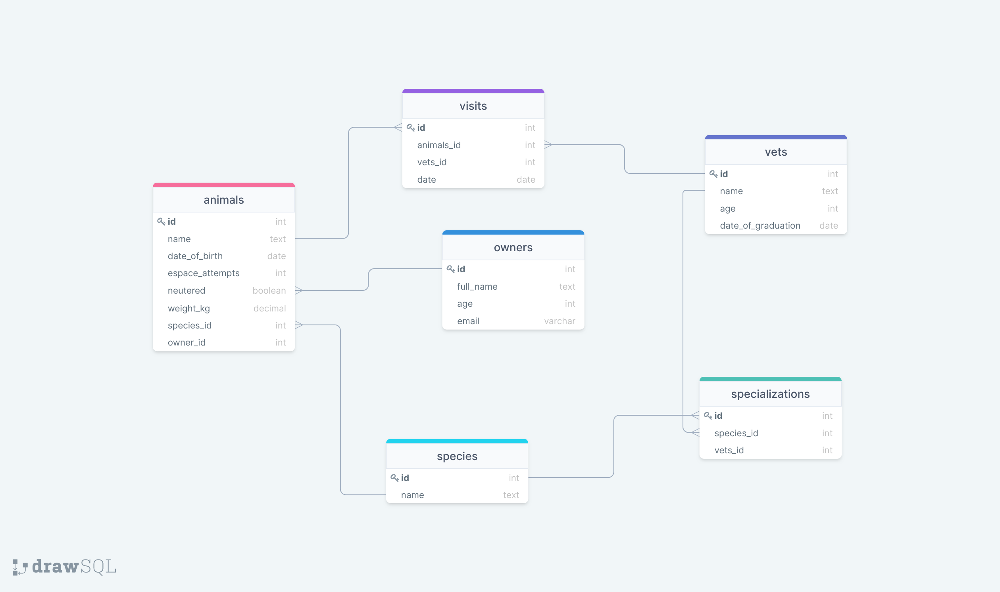

# Vet-clinic

This project used the relational database to create the data structure for a vet clinic. Apart from the building data structure, here will be challenged with tasks that require SQL queries to answer specific questions.

## Diagram 



## Built with

- SQL
- Postgresql

## Get Started

This repository includes files with plain SQL that can be used to recreate a database:

 ```
   git clone <URL> in your terminal
   ```

- Use [schema.sql](./schema.sql) to create all tables.
- Use [data.sql](./data.sql) to populate tables with sample data.
- Check [queries.sql](./queries.sql) to list of queries

## Author

👤 **Yannick-Noel AKA**

- Location: Côte d'Ivoire
- GitHub: [@codecaiine](https://github.com/codecaiine)
- Twitter: [@yannicknaka](https://twitter.com/yannicknaka)
- LinkedIn: [LinkedIn](https://www.linkedin.com/in/yannick-no%C3%ABl-aka/)

👤 **Yannick-Noel AKA**

## 🤝 Contributing

Contributions, issues, and feature requests are welcome!

Feel free to check the [issues page](https://github.com/codecaiine/bookstore-react-redux/issues).

## Show your support

Give a ⭐️ if you like this project!

## Acknowledgments

- Thanks to Microverse
- Yannick AKA
